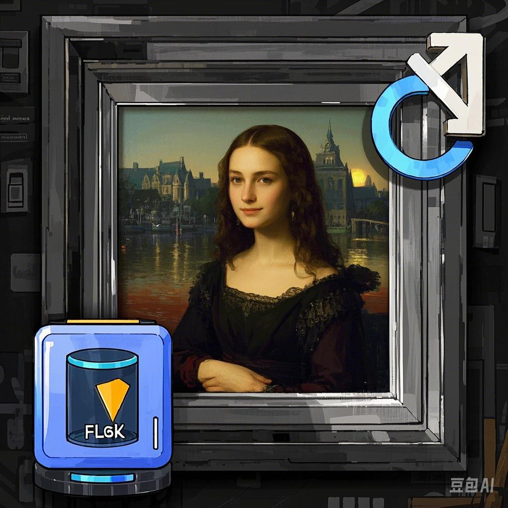

# 随机图片&每日一图

一个基于 Flask 的网页服务，提供随机图片和每日一图功能，支持本地文件夹（如 NAS）中的图片自动刷新显示。

## 功能特点

- 🖼️ 两种访问方式：
  - 网页界面（`http://localhost:5000`）：完整控制面板，包含显示设置
  - 直接图片链接（`http://localhost:5000/img/today.jpg`）：固定地址，自动更新

- 🔄 灵活的刷新选项：
  - 使用 cron 表达式自定义间隔
  - 手动刷新按钮
  - 标签页激活时自动刷新

- 📱 智能显示模式：
  - 智能模式（自动适应图片方向）
  - 宽度撑满模式
  - 高度撑满模式
  - 拉伸撑满模式

- 🚀 性能优化：
  - 图片缓存
  - 带宽感知更新
  - 非活动标签页资源节省

## 应用场景

- 电子相框：自动轮播显示您的照片集
- 动态壁纸：配合支持 URL 图片的壁纸程序使用
- 主页背景：作为个人主页或仪表盘的背景
- 子面板背景：集成到 Homepage 或 Sub-panel 等工具，实现动态背景

## 快速开始

1. 拉取 Docker 镜像：
```bash
docker pull baozaolaowu/random-img-server:latest
```

2. 运行容器：
```bash
docker run -d \
  -p 5000:5000 \
  -v "/path/to/your/images:/app/images" \
  --name random-img-server \
  baozaolaowu/random-img-server:latest
```

3. 访问服务：
- 网页界面：`http://localhost:5000`
- 直接图片链接：`http://localhost:5000/img/today.jpg`

## 配置说明

### 环境变量
- `IMAGE_FOLDER`：图片文件夹路径（默认：./images）

### 图片要求
- 支持的格式：PNG、JPG、JPEG、GIF、BMP
- 最大文件大小：50MB

### Cron 表达式示例
- `*/5 * * * *` → 每5分钟
- `*/30 * * * *` → 每30分钟
- `0 * * * *` → 每小时整点
- `0 */2 * * *` → 每2小时
- `0 9 * * 1-5` → 工作日上午9点

---

# Random Image & Daily Picture

A Flask-based web service that provides random images and daily pictures from your local folder (e.g., NAS) with automatic refresh functionality.

## Features

- 🖼️ Two ways to access images:
  - Web interface (`http://localhost:5000`): Full control panel with display settings
  - Direct image URL (`http://localhost:5000/img/today.jpg`): Fixed URL that updates automatically

- 🔄 Flexible refresh options:
  - Customizable intervals using cron expressions
  - Manual refresh button
  - Auto-refresh when tab becomes active

- 📱 Smart display modes:
  - Smart mode (automatically adapts to image orientation)
  - Width fill mode
  - Height fill mode
  - Stretch fill mode

- 🚀 Performance optimized:
  - Image caching
  - Bandwidth-aware updates
  - Resource-saving when tab is inactive

## Use Cases

- Digital Photo Frame: Display your photo collection with automatic rotation
- Dynamic Wallpaper: Use with wallpaper apps that support URL-based images
- Homepage Background: Perfect for homepage or dashboard background
- Sub-panel Background: Integrate with tools like Homepage or Sub-panel for dynamic backgrounds

## Quick Start

1. Pull the Docker image:
```bash
docker pull baozaolaowu/random-img-server:latest
```

2. Run the container:
```bash
docker run -d \
  -p 5000:5000 \
  -v "/path/to/your/images:/app/images" \
  --name random-img-server \
  baozaolaowu/random-img-server:latest
```

3. Access the service:
- Web interface: `http://localhost:5000`
- Direct image URL: `http://localhost:5000/img/today.jpg`

## Configuration

### Environment Variables
- `IMAGE_FOLDER`: Path to images folder (default: ./images)

### Image Requirements
- Supported formats: PNG, JPG, JPEG, GIF, BMP
- Maximum file size: 50MB

### Cron Expression Examples
- `*/5 * * * *` → Every 5 minutes
- `*/30 * * * *` → Every 30 minutes
- `0 * * * *` → Every hour
- `0 */2 * * *` → Every 2 hours
- `0 9 * * 1-5` → Weekdays at 9:00 AM

## API Endpoints API接口